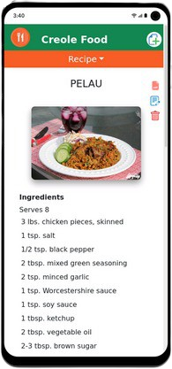
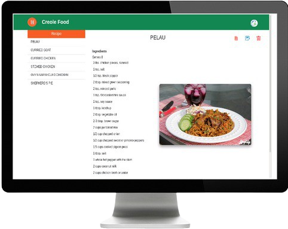

<h1 align="center">
  <br>
  <a href="https://nhope123.github.io/creole_food/"></a>
  <br>
  Creole Food
  <br>
</h1>

<h4 align="center">Online cooking recipe organizer.</h4>


<p align="center">
  <a href="#key-features">Key Features</a> •
  <a href="#how-to-use">How To Use</a> •
  <a href="#credits">Credits</a> •
  <a href="#authors">Authors</a> •
  <a href="#license">License</a>
</p>

 

## Key Features

- Add recipes to the the default recipe collection.
	+ Required input:
		* Title - The title of the recipe.
		* Serving - The number ofpossible servings.
		* Ingredients - List of all ingredients.
		* Direction - List of steps for completion.
	+ Optional input: 
		* Image - Url of image location.
		* Note - Additional notes accompanying the recipe.
- Edit existing recipes from the collection.
- Remove existing recipes from the collection.
- Preview edited or created recipes before adding to the collection.
- Download pdf version of a recipe from the collection.

## How To Use

1. Run [online live](https://nhope123.github.io/creole_food/) version.
2. Clone and run this application. You'll need [Git](https://git-scm.com) and [Node.js](https://nodejs.org/en/download/) (which comes with [npm](http://npmjs.com)) installed on your computer. From your command line:

```bash
# Clone this repository
$ git clone https://github.com/nhope123/creole_food.git

# Go into the repository
$ cd creole_food

# Install dependencies
$ npm install

# Run the app
$ npm start
```

Note: If you're using Linux Bash for Windows, [see this guide](https://www.howtogeek.com/261575/how-to-run-graphical-linux-desktop-applications-from-windows-10s-bash-shell/) or use `node` from the command prompt.


## Credits

This software uses the following open source packages:

- [React](https://reactjs.org/) - A JavaScript library for building user interfaces
- [Redux](https://redux.js.org/) - A Predictable State Container for JS Apps
- [Redux-toolkit](https://redux-toolkit.js.org/) - The official toolset for efficient Redux development
- [Node.js](https://nodejs.org/) - An asynchronous event-driven JavaScript runtime
- [Bootstrap](https://getbootstrap.com/) - CSS framework for managing UI layout.- 
- [React Modal](https://reactcommunity.org/react-modal/) - Accessible modal dialog component for React.JS
- [pdfMake](https://pdfmake.github.io/docs/0.1/) - PDF document generation library for server-side and client-side.
- [icon-icons](https://icon-icons.com/) - Free icons for personal and commercial use

## Authors
+ [Nial Hope](https://github.com/nhope123) - Repository
  + [Portfolio](https://nhope123.github.io/)
  + [Linkedin](https://www.linkedin.com/in/nialhope/)

## License

Creole Food is an open source software licensed as [GNU General Public License v3.0](LICENSE).

